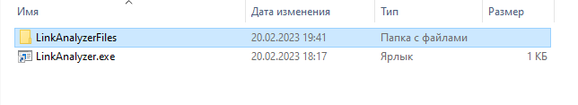
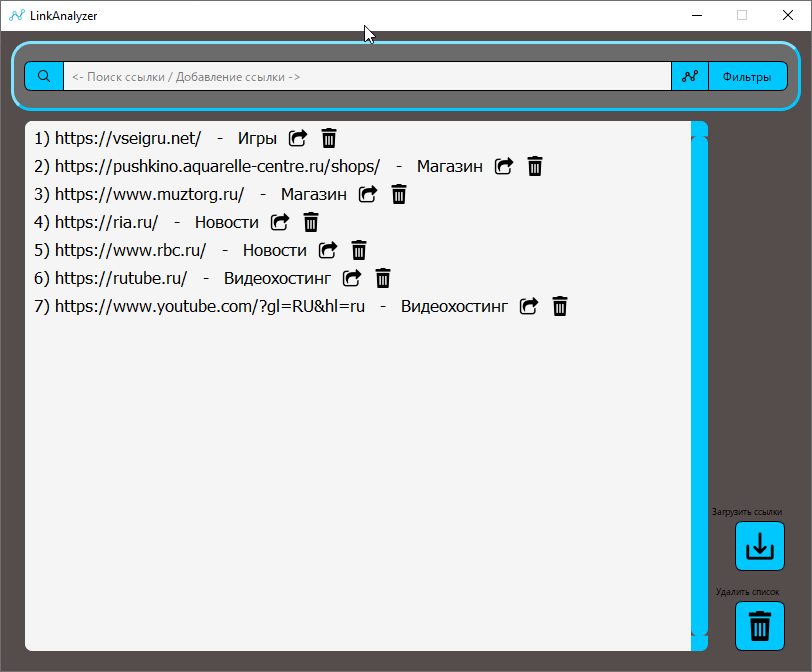
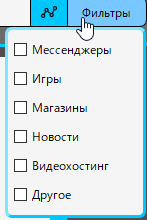
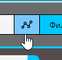
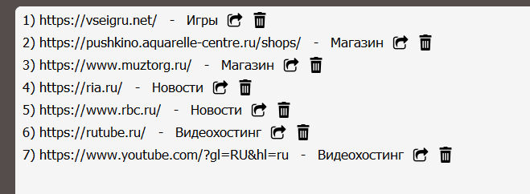

# Case Project. 

Проект для финального этапа предпрофф Олимпиады. В проекте реализовано desktop-приложение для анализа и сортировки интернет ресурсов по различным типам.

## Описание
Проект разработан как Десктпное приложение для windows. Тестировался на Win7, Win10, Win11, а так же исходный код запускался на операционных системах симейства Linux, такие как Debian 11 и 12 версий, Ubuntu 19. 

В основе положен парсер, получающий данные с сайта, простая нейронная сеть, написанная нами, которая анализирует сайт по шести различным типам:

- Новости
- Магазины
- Игры
- Видеохостинг
- Мессенджер
- Прочее

База данных на основе SQLite3, которая сохраняет данные в формате
#### База данных


| Ссылка | Тип ссылки | Дополнительная информация|
| :-------- | :------- | :------------------------- |
| Анализируемая ссылка | ее тип (в числовом формате 0-5) | Отметка о принадлежности ссылки к созданной группе |

---

Пользователь вводит ссылку в input-box, после чего нажимает кнопку "Проанализировать". Парсер получает по ссылке html-код страницы и собирает слова, характерные для опредеденных типов сайтов. Например, "Купить" или "Цена" более характерны для интернет-магазинов, нежели для сайтов с играми. Подсчитывая слова, нееросеть определяет, к какому типу относится сайт, после чего информация о ссылке сохраняется в базу данных. Пользователь может искать среди сохраненных ссылок нужную по ключевому слову, по оставленным меткам или же по типам. 

Проект выполнен в виде Desktop-приложения, что очень удобно для пользователя.
## Screenshots



Собранный exe-файл для запуска на Windows



Внешний вид приложения



Типы сайтов для сортировки



Кнопка для начала сканирования ссылки



Уже отсканированные ссылки

## Tech Stack

**Langs:** Python 3.x, SQL-запросы

**Python usage:** Request, BS4, SQLite, PyQt5, numpy, fuzzywuzzy

**Another:** Figma, Git, Jira, Weeek

**Server for Neyron:** Ssh, Docker, Linux Debian 10.

## Roadmap

- Создание программы парсера

- Создание и обучение нейронной сети для анализа

- Создание Дизайна приложения

- Соединение всех частей в один проект


## Lessons Learned

В рамках этого проекта я:
- Научился работать в команде
- Укрепил навык работы с Git-репозиторием
- Написал свою первую, хоть и простую, нейронную сеть
- Собрал проект из Python-проекта в exe-приложения для запуска пользователями
- Научился создавать графические оболочки для desktop-приложений


## В будущем будет сделано:

- Темная и светлая тема (переключение)
- Улучшена архитектура нейронной сети
- Импорт вкладок из браузера и экспорт в барузер
- Продолжится работа над Кроссплатформенностью
- Будет увеличено количество типов сайтов и дообучена нейронная сеть


## Installation

Для установки Вы можете сделать следующее:

### Exe-файл
1. Скачать файл по [ссылке](https://disk.yandex.ru/d/UiAUW1_CSlcUSA)
2. Разархивировать файлы
3. Запустить LinkAnalizer.exe двойным нажатием.

### Запуск исходного кода проекта:
1. Клонировать Git-репозиторий себе на устройство, выполнив следующую команду в новой папке
```
git clone https://github.com/Igggor/Case.git
```
2. Установить зависимости в новое виртуальное окружение:
```
pip install -r requirements.txt
```
3. Запустить проект:
```
python3 design/PyQTCase.pyw
```

    
## Authors

- [Игорь](https://github.com/Igggor)

- [Александр](https://t.me/bleb1337)


## Used By

Этот проект используется:

- В школе, на школьном оборудовании для сохранения полезных для учебы ссылок
- Пользователями для работы со ссылками

